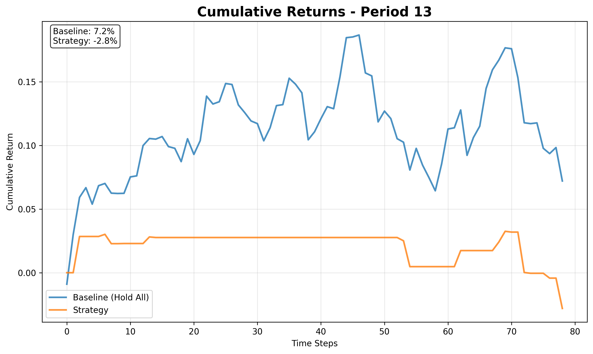

## Implementation of "Stockformer: A Price-Volume Factor Stock Selection Model Based on Wavelet Transform and Multi-Task Self-Attention Networks"

This repository is still under development and may contain bugs or incomplete features. It is intended for research purposes and not for production use.

This repository contains an implementation of the paper:

> **Stockformer: A Price-Volume Factor Stock Selection Model Based on Wavelet Transform and Multi-Task Self-Attention Networks**  
> *Bohan Ma, Yushan Xue, Yuan Lu, and Jing Chen*  
> [arXiv:2401.06139](https://arxiv.org/abs/2401.06139) (2024)

**Citation:**

```bibtex
@misc{ma2024stockformerpricevolumefactorstock,
    title={Stockformer: A Price-Volume Factor Stock Selection Model Based on Wavelet Transform and Multi-Task Self-Attention Networks},
    author={Bohan Ma and Yushan Xue and Yuan Lu and Jing Chen},
    year={2024},
    eprint={2401.06139},
    archivePrefix={arXiv},
    primaryClass={q-fin.TR},
    url={https://arxiv.org/abs/2401.06139}
}
```

## Project Structure

### Core Implementation Files

| File | Description | Key Features |
|------|-------------|--------------|
| `StockFormer.py` | Main model implementation | Multi-task transformer with price-volume factors, wavelet-based decoupling, dual-frequency encoder/decoder, temporal and stock-wise attention, signal generation |
| `preprocess.py` | Data preprocessing pipeline | Downloads stock data, creates price/volume features, neutralizes factors by industry/market cap, standardizes per period, generates time series splits for training/validation/test |
| `train.py` | Model training script | Multi-task loss (regression + classification), sequential period training with optimizer reset and learning rate decay, early stopping, real-time loss visualization |
| `backtest_engine.py` | Backtesting framework | Single-period backtest, portfolio simulation, risk metrics, Sharpe ratio, performance summary, cumulative return plotting, strategy vs baseline comparison |
| `predict_engine.py` | Inference/prediction script | Loads trained model, prepares latest data, generates and prints trading signals for given tickers |

### Generated Output Files

#### Data Files
- **`processed_data.csv`** - Raw processed stock data with technical indicators
- **`period_splits.pkl`** - Time series splits with standardization statistics for training/validation/test
- **`stockformer_model.pth`** - Trained PyTorch model weights

#### Results & Analysis
- **`backtest_period.png`** - Comprehensive backtesting visualization

## Sample Output Files

### Example Backtest Plot



### Backtest Visualization (`backtest_results.png`)
The generated plot contains four panels:
1. **Portfolio Value vs Baseline** - Time series comparison across all periods
2. **Returns by Period** - Bar chart showing portfolio vs baseline performance
3. **Sharpe Ratios** - Risk-adjusted performance comparison
4. **Cumulative Performance** - Combined multi-period performance trajectory

### Model Architecture Summary
```
StockFormer Model:
├── Input: (batch_size, sequence_len=20, num_stocks=10, num_features=362)
├── Temporal Attention: Multi-head self-attention across time
├── Stock Attention: Cross-stock relationship modeling  
├── Multi-task Output: Returns prediction + Trend classification
└── Output: (batch_size, prediction_len, num_stocks) [return_pred, trend_pred]   (batch_size, pred_len, num_stocks)
```

### Usage Pipeline

Before you begin, install the required dependencies:

```bash
pip install -r requirements.txt
```

1. **Data Preprocessing**
   ```bash
   python preprocess.py
   ```
   - Downloads stock data via yfinance
   - Creates technical indicators and price-volume factors
   - Generates period splits with proper standardization

2. **Model Training**
   ```bash
   python train.py --epochs 200 --batch_size 2048
   ```
   - Trains StockFormer on multi-period data
   - Real-time loss visualization
   - Saves best model based on validation loss

3. **Backtesting**
   ```bash
   python backtest_engine.py --capital 100000 --cost 0.001
   ```
   - Simulates portfolio performance
   - Generates trading signals from model predictions
   - Compares against buy-and-hold baseline

## Command Line Options

### Training (`train.py`)
```bash
python train.py [OPTIONS]
  --data          Path to period splits file (default: period_splits.pkl)
  --epochs        Number of training epochs (default: 200)
  --batch_size    Training batch size (default: 2048)
  --device        Device to use: cuda/cpu (auto-detected)
  --model_path    Path to save/load model (default: stockformer_model.pth)
```

### Backtesting (`backtest_engine.py`)
```bash
python backtest_engine.py [OPTIONS]
  --data          Path to period splits data (default: period_splits.pkl)
  --capital       Initial capital in USD (default: 100000)
  --cost          Transaction cost as decimal (default: 0.001)
  --output        Output plot filename (default: backtest_results.png)
```

## Data Pipeline Details

### Preprocessing Steps
1. **Data Collection**: Downloads OHLCV data for configurable stock universe
2. **Technical Indicators**: Calculates price-volume factors, moving averages, volatility
3. **Factor Neutralization**: Adjusts for industry and market cap effects
4. **Standardization**: Z-score normalization with period-specific statistics
5. **Time Series Splits**: Creates overlapping periods for training/validation/test

### Generated Features (362 total)
- **Qlib Alpha360**: 360 technical indicators
- **Trend Direction**: 1 feature (up/down trend classification)
- **Returns**: 1 feature (future returns prediction)

## Performance Metrics

The backtesting engine produces comprehensive performance analysis including:

- **Portfolio vs Baseline Returns** - Period-by-period comparison
- **Sharpe Ratios** - Risk-adjusted performance metrics  
- **Alpha Generation** - Excess returns over baseline
- **Trade Analysis** - Number of trades, win rate, volatility
- **Risk Management** - Position sizing, exposure limits, transaction costs

## Key Features

- **Multi-Task Learning**: Simultaneous regression (returns) and classification (trend direction)
- **Temporal Attention**: Captures time dependencies in stock price movements
- **Stock-Wise Attention**: Models inter-stock relationships and correlations
- **Factor Neutralization**: Industry and market-cap adjusted factors
- **Realistic Backtesting**: Includes transaction costs, position sizing and exposure limits

### Data Requirements
- Stock universe should have consistent trading history
- Minimum 2+ years of daily data (recommended)
- Handle stock delistings and splits appropriately
